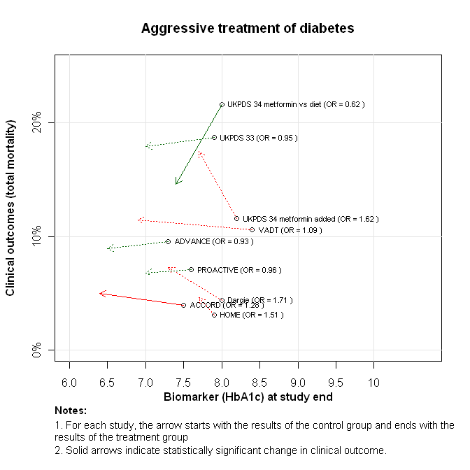
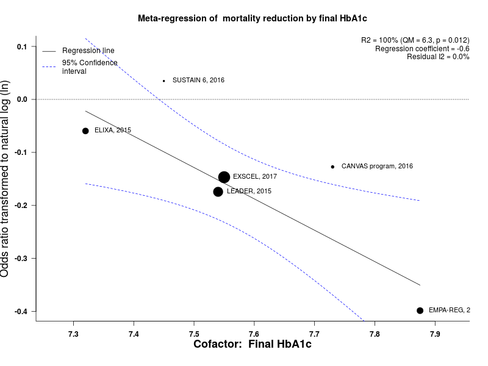

Diabetes mellitus type 2 mortality prevention with pharmacotherapy
============================================
A living systematic review with arrows plot

Short url: http://openMetaAnalysis.github.io/Diabetes-mellitus-type-2-mortality-prevention-with-pharmacotherapy

**Clinical summary:** This meta-analysis suggests that clinical intervention *is not* effective. Heterogeneity of results as measured by I2 was '[moderate](http://handbook.cochrane.org/chapter_9/9_5_2_identifying_and_measuring_heterogeneity.htm)' at 64%. This review updates the previously published meta-analysis.(1)

Mortality reduction *is* shown in the subgroups of trials that used sodium glucose transporter 2 (SGLT2) inhibitors or GLP-1 receptor agonists.

Acknowledgement: we acknowledge the essential work by the authors of the prior systematic review(s) listed below.

**Methods overview:** This repository is an [openMetaAnalysis](https://openmetaanalysis.github.io/) that combines methods of scoping, rapid, and living systematic reviews.  This analysis updates one or more previously published review(s).(1) A comparison of studies include in this review compared to prior reviews are in the table, [reconciliation of trials included with prior meta-analyses/](files/reconciliation-tables/Reconciliation%20of%20studies.pdf). Newer studies included are listed in the references below. Rationale for newer trials excluded may be listed at the end of the references. 
* [Methods](http://openmetaanalysis.github.io/methods.html) for openMetaAnalysis
* [Evidence search](files/searching/evidence-search.md) for this review (under construction)

**Results:** Details of the studies included are in the:
* [Reconciliation of trials included with prior meta-analyses/](files/reconciliation-tables/Reconciliation%20of%20studies.pdf) (under construction)
* [Description of studies (PICO table)](files/study-details/table-pico.pdf) (under construction)
* [Risk of bias assessment](files/study-details/table-bias.pdf) (under construction)
* [Forest plots](../master/files/forest-plots) ([source data](files/data))
* [Network plots](../master/files/network) (optional)
* [Reconciliation of conclusions with prior meta-analyses](files/reconciliation-tables/Reconciliation%20of%20conclusions.pdf)

The forest plot for the primary outcomes are below. Additional [forest-plots](files/forest-plots) of secondary analyses may be available. 

The arrows plot for the primary outcomes are below. Additional [arrows-plots](files/arrows-plots) of secondary analyses may be available. 

The meta-regression for the primary outcomes are below. Additional [metaregressions](files/metaregression) of secondary analyses may be available. 

References:
----------------------------------

### Systematic review(s)
#### Most recent review at time of last revision of this repository
1. Huang CJ, Wang WT, Sung SH, Chen CH, Lip GYH, Cheng HM, Chiang CE. Blood glucose reduction by diabetic drugs with minimal hypoglycaemia risk for
cardiovascular outcomes: Evidence from meta-regression analysis of randomized controlled trials. Diabetes Obes Metab. 2018 May 2. doi: [10.1111/dom.13342](http://doi.org/10.1111/dom.13342). PMID: [29722116](https://pubmed.gov/29722116)

### Randomized controlled trials
#### New trial(s) *not* included in the most recent review above
None
#### Trial(s) included in the review above
None

#### Trial(s) undergoing review
None

#### Trial(s) excluded - selected list of important trial(s)

#### Cited by
This repository is cited by:

1. WikiDoc contributors. Diabetes mellitus type 2 medical therapy. WikiDoc. June 11, 2018. Available at: https://www.wikidoc.org/index.php/Diabetes_mellitus_type_2_medical_therapy. Accessed June 11, 2018. 
2. Badgett RG, Dong F, Aung K. Arrow plot: a display for results of meta-analyses of surrogate and clinical outcomes. BMJ 2011. Available at https://www.bmj.com/rapid-response/2011/11/03/arrow-plot-display-results-meta-analyses-surrogate-and-clinical-outcomes. Accessed June 11, 2018. 

-------------------------------
[Cite and use this content](https://github.com/openMetaAnalysis/openMetaAnalysis.github.io/blob/master/reusing.MD)  - [Edit this page](../../edit/master/README.md) - [History](../../commits/master/README.md)  - 
[Issues and comments](../../issues?q=is%3Aboth+is%3Aissue)

